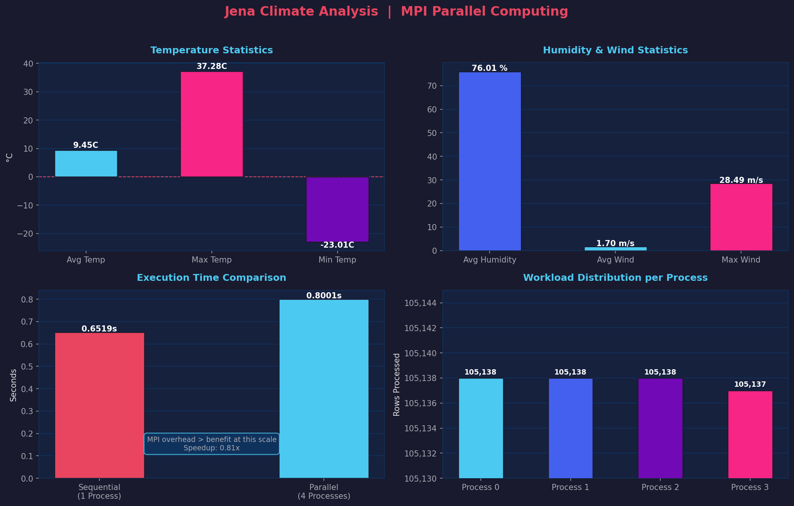
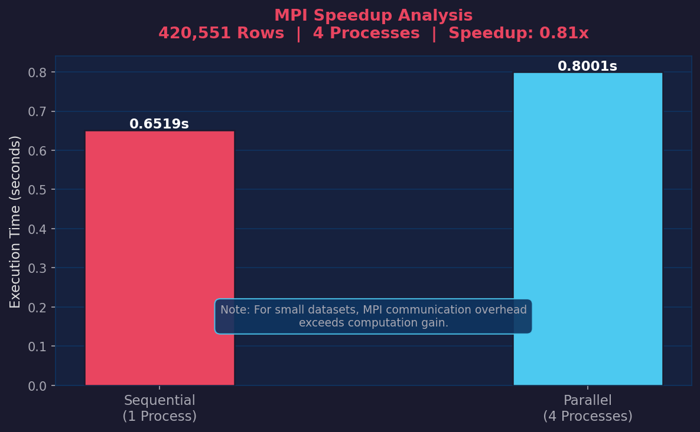

# Weather Data Analysis using MPI
A parallel computing project analyzing climate data using MPI (Message Passing Interface) in Python.
Large weather dataset distributed across multiple MPI processes. Each process computes local statistics independently. Results gathered at root process and combined for final output.

## Tech Stack

## Project Structure
- src/preprocess.py — Data cleaning
- src/parallel_analysis.py — MPI parallel processing
- src/visualize.py — Charts and visualization
- output/ — Generated charts

## Dataset
- Source: Jena Climate Dataset from Kaggle
- Size: 420,551 rows, 15 columns
- Period: 2009 to 2016
- Features: Temperature, Humidity, Wind Speed, Pressure

## How to Run

Install dependencies:
- sudo apt install mpich python3-pip
- pip3 install mpi4py pandas matplotlib seaborn --break-system-packages

Step 1 - Preprocess data:
- python3 src/preprocess.py

Step 2 - Run parallel analysis with 4 processes:
- mpirun -n 4 python3 src/parallel_analysis.py

Step 3 - Generate visualizations:
- python3 src/visualize.py

## Performance

Sequential (1 process)  : 0.6519s
Parallel (4 processes)  : 0.8001s
Speedup                 : 0.81x

Note: MPI communication overhead exceeds computation gain at this dataset size.
This is expected behavior for I/O bound tasks on small data.
Speedup improves significantly with heavier computations and larger datasets.

## MPI Strategy
- Scatter: Root splits 420k rows into 4 equal chunks
- Local Compute: Each process calculates stats independently  
- Gather: Root collects and combines all results

## Course
Parallel and Distributed Computing

## Output Charts

